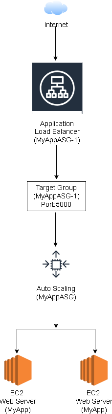
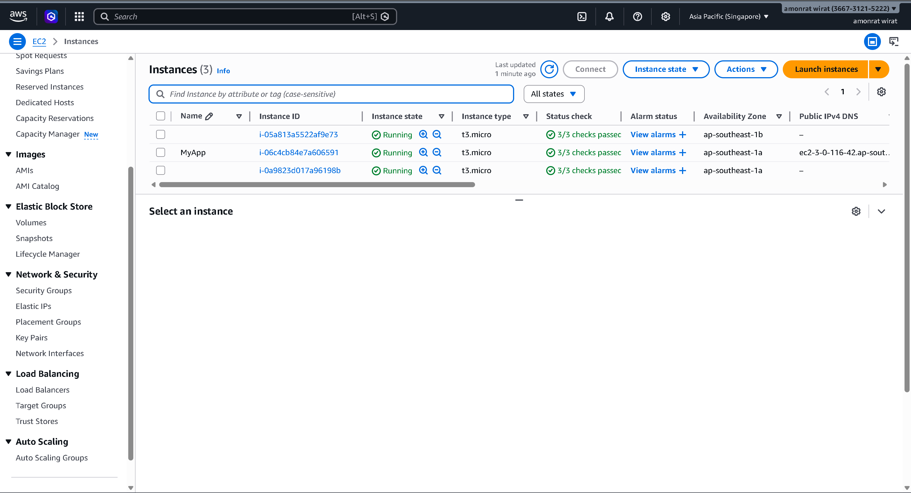
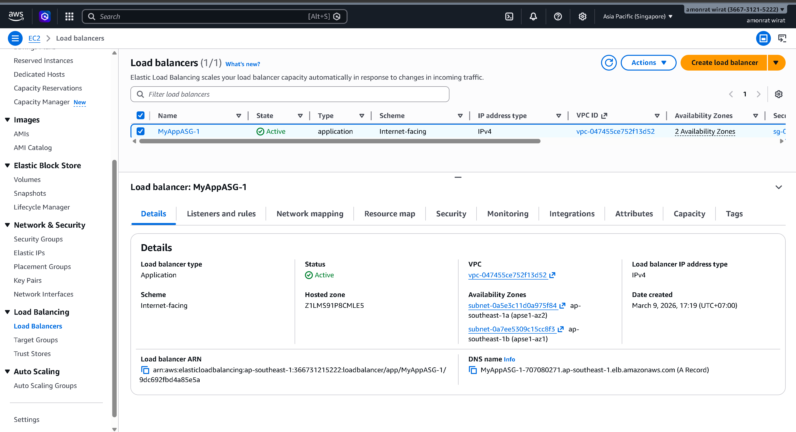
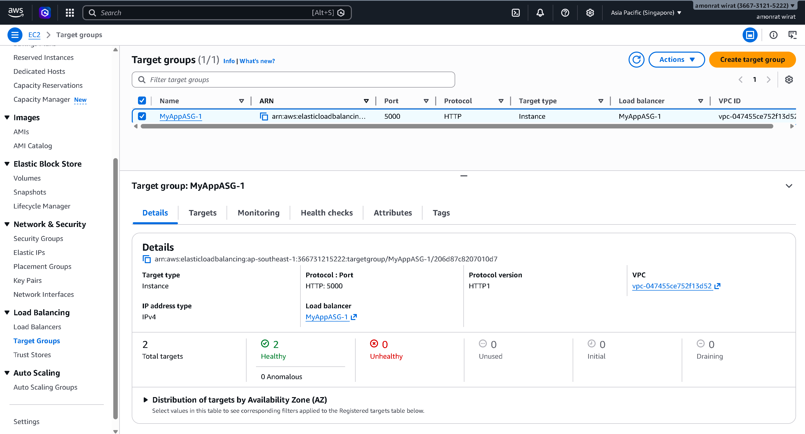
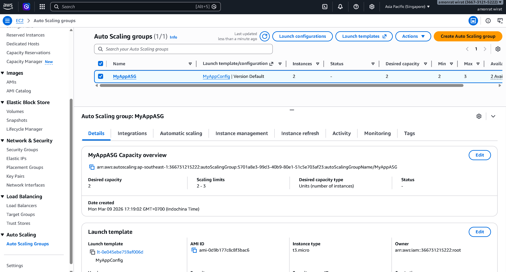

# AWS Auto Scaling with Application Load Balancer

This project demonstrates how to deploy a scalable web application using AWS services.

## Architecture

This architecture demonstrates a scalable web application deployed on AWS.
Traffic from the Internet is routed through an Application Load Balancer (ALB),
which forwards requests to EC2 instances managed by an Auto Scaling Group.

## AWS Services Used

- Amazon EC2
- Application Load Balancer
- Target Group
- Auto Scaling Group

## Architecture Flow

Internet → Application Load Balancer → Target Group → Auto Scaling Group → EC2 Instances

## Screenshots

### EC2 Instances

### Load Balancer

### Target Group

### Auto Scaling Group

### Web Application (Hello World)

## Features
- High availability using Auto Scaling
- Load balancing with Application Load Balancer
- Health checks using Target Group
- Scalable EC2 web servers
